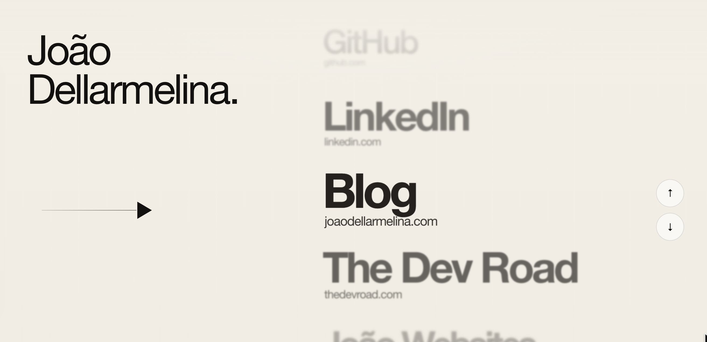

# URL 4show

Scroll experience website for a link **showroom**.



An animated link page built with `Next.js`, `GSAP`, and `@bsmnt/scrollytelling`.

The project concept is simple: you manage your links in a JSON file, customize metadata in another JSON file, and the homepage generates a scroll experience highlighting the central item.


## What this project delivers

- Homepage with animated vertical scroll and fixed viewport
- Featured central link
- Peripheral links with reduced scale and opacity
- Navigation via scroll, keyboard, and buttons
- Link configuration via `JSON`
- Metadata/SEO configuration via `JSON`

## Stack

- `Next.js 16`
- `React 19`
- `TypeScript`
- `GSAP`
- `@bsmnt/scrollytelling`

## Prerequisites

Before starting, ensure you have installed:

- `Node.js 20+`
- `pnpm`

If you don't have `pnpm` yet:

```bash
npm install -g pnpm

```

## Installation

Clone the repository:

```bash
git clone <REPOSITORY_URL>
cd url-exhibition

```

Install dependencies:

```bash
pnpm install

```

Start the project in development mode:

```bash
pnpm dev

```

Open in your browser:

```text
http://localhost:3000

```

## Key structure

The files you will likely edit most frequently are:

* `data/links.json`
* `data/site-metadata.json`
* `components/link-exhibition.tsx`
* `components/link-exhibition.module.css`

## How to add or edit links

All page links are located in:

[`data/links.json`](https://www.google.com/search?q=./data/links.json)

Structure for each item:

```json
{
  "id": "blog",
  "title": "Blog",
  "subtitle": "joaodellarmelina.com",
  "href": "[https://joaodellarmelina.com](https://joaodellarmelina.com)"
}

```

### Fields

* `id`: unique identifier for the item
* `title`: main displayed text
* `subtitle`: secondary text displayed below the title
* `href`: URL opened when clicking the central item

### Example

```json
[
  {
    "id": "linkedin",
    "title": "LinkedIn",
    "subtitle": "",
    "href": "[https://www.linkedin.com/in/your-username/](https://www.linkedin.com/in/your-username/)"
  },
  {
    "id": "github",
    "title": "GitHub",
    "subtitle": "[github.com/your-username](https://github.com/your-username)",
    "href": "[https://github.com/your-username](https://github.com/your-username)"
  },
  {
    "id": "blog",
    "title": "Blog",
    "subtitle": "mysite.com",
    "href": "[https://mysite.com](https://mysite.com)"
  }
]

```

## Default link on launch

Currently, the project attempts to always open with the item whose `id` is:

```json
"first"

```

If you want to keep this behavior, make sure an item exists with:

```json
{
  "id": "first"
}

```

If you want to change the default, edit the `DEFAULT_LINK_ID` constant in:

[`components/link-exhibition.tsx`](https://www.google.com/search?q=./components/link-exhibition.tsx)

## How to edit page metadata

Metadata is located in:

[`data/site-metadata.json`](https://www.google.com/search?q=./data/site-metadata.json)

You can customize:

* `title`
* `description`
* `applicationName`
* `keywords`
* `authors`
* `creator`
* `publisher`
* `metadataBase`
* `openGraph`
* `twitter`
* `robots`

### Example

```json
{
  "title": "Links | Your Name",
  "description": "My links page.",
  "applicationName": "URL Exhibition",
  "metadataBase": "[https://links.yourdomain.com](https://links.yourdomain.com)",
  "openGraph": {
    "title": "Links | Your Name",
    "description": "My links page.",
    "url": "[https://links.yourdomain.com](https://links.yourdomain.com)",
    "siteName": "URL Exhibition",
    "locale": "en_US",
    "type": "website"
  }
}

```

## How to customize appearance

### Layout and behavior

The main scrollytelling logic is in:

[`components/link-exhibition.tsx`](https://www.google.com/search?q=./components/link-exhibition.tsx)

There you can adjust:

* initial item
* scroll progression
* item scale
* opacity
* blur
* keyboard navigation
* click action on active item

### Styling

The main CSS is in:

[`components/link-exhibition.module.css`](https://www.google.com/search?q=./components/link-exhibition.module.css)

There you can adjust:

* background
* typography
* link positions
* side arrows
* controls
* top and bottom fade
* responsiveness

## Recommended workflow for open-source usage

### 1. Fork or clone the project

Create your copy of the repository and install dependencies.

### 2. Edit your links

Replace the contents of `data/links.json` with your real links.

### 3. Edit your metadata

Update `data/site-metadata.json` with your domain, title, and description.

### 4. Adjust appearance

If you want it to match your visual identity, modify the module's CSS.

### 5. Validate locally

Before publishing:

```bash
pnpm lint
pnpm build

```

### 6. Publish

You can deploy to any platform compatible with Next.js, such as:

* Vercel
* Netlify
* Railway
* custom Node server

## Deploying on Vercel

The simplest method is:

1. push the project to GitHub
2. import the repository into Vercel
3. keep the default commands:

```text
Install Command: pnpm install
Build Command: pnpm build
Output: Next.js default

```

## Best practices for contributing

If you share the project for others to use:

* keep `links.json` with simple examples
* avoid committing sensitive personal links into the template
* document any behavior changes in the README
* run `pnpm lint` before committing changes

## License

This project is under the `MIT` license. See the [`LICENSE`](https://www.google.com/search?q=./LICENSE) file.

```

```
